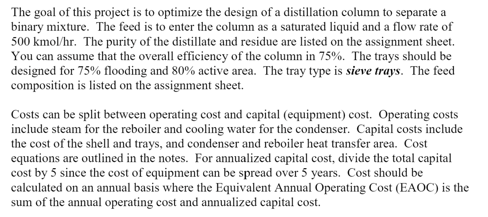
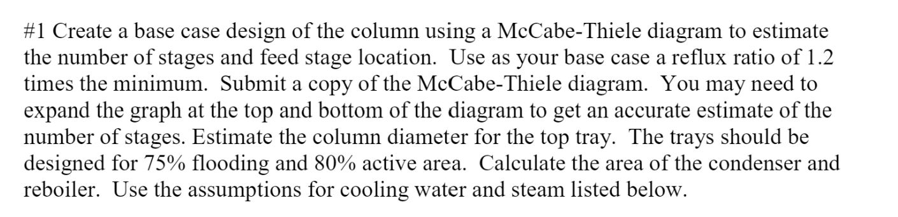
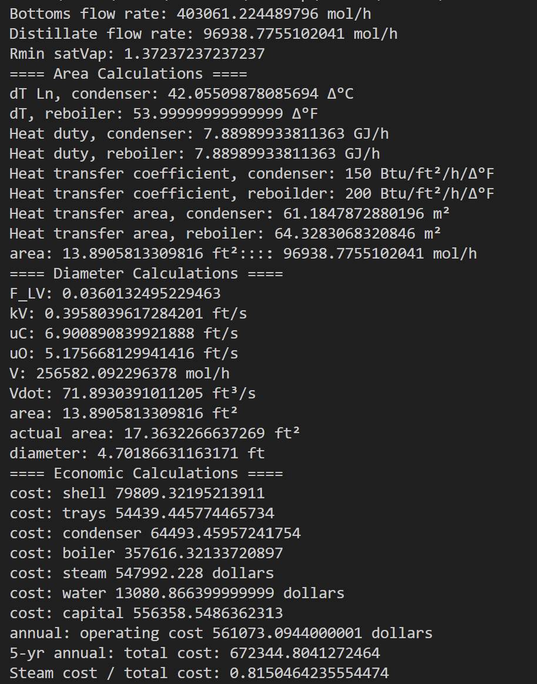
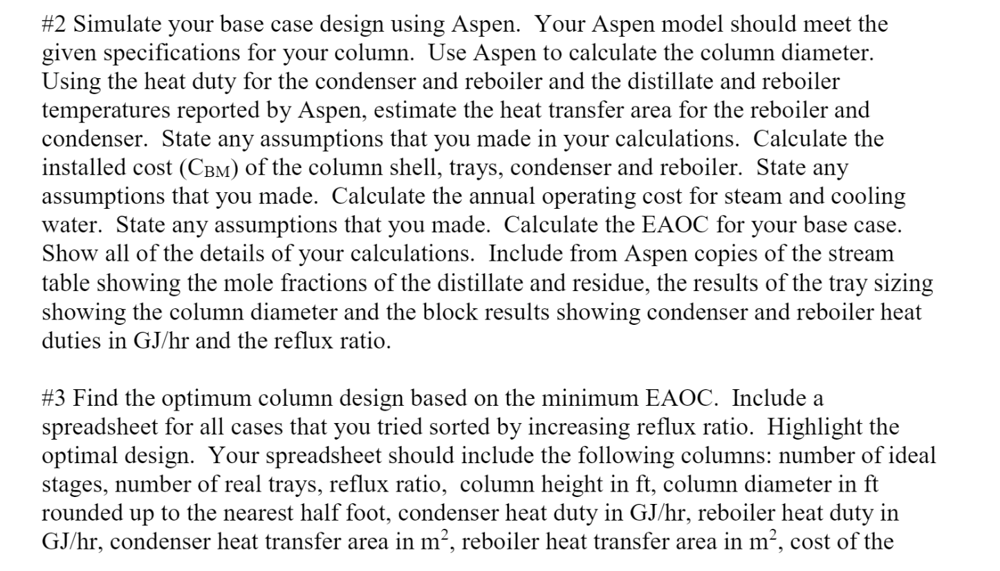
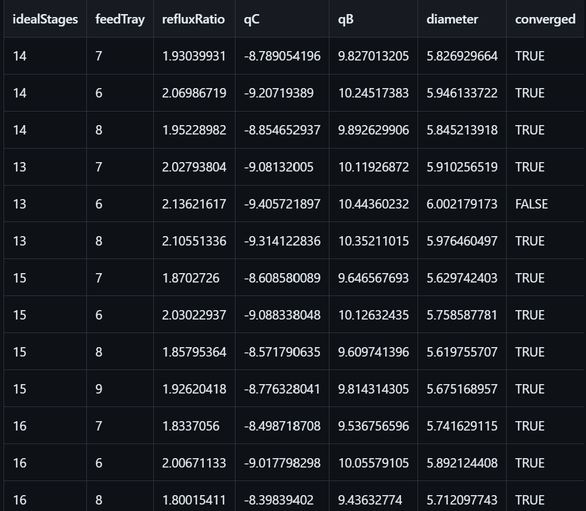
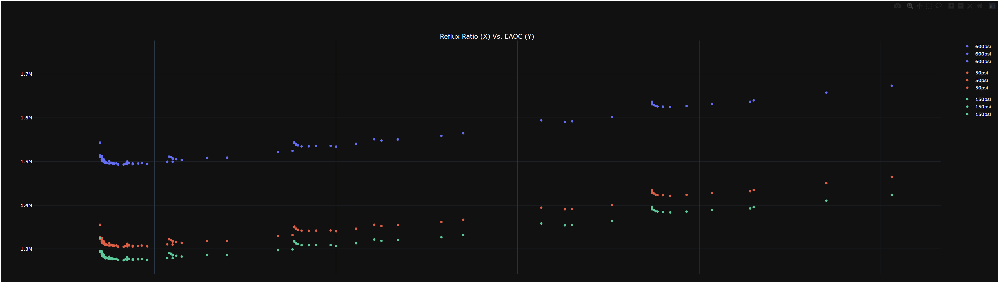
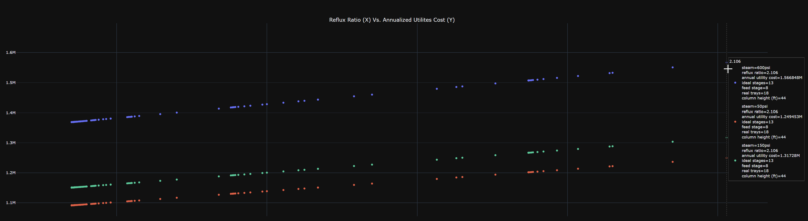
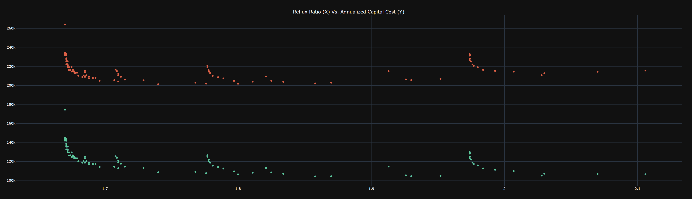

# Distillation Project

## Overall Objective

[Link to problem statement (PDF)](assets/problem_statement.pdf)

## Base Case

[Script](https://github.com/hunterviolette/CHE362/blob/master/distillation_proj/base_case.py)

## Aspen Simulation and Optimum

- Generate input data by iterating over the number of trays and feed tray in Aspen

## Results
  - [Script](https://github.com/hunterviolette/CHE362/blob/master/distillation_proj/main.py)
  - [Export Data](https://github.com/hunterviolette/CHE362/blob/master/distillation_proj/export/main.csv)
  - [Export Figures (Open with any browser)](https://github.com/hunterviolette/CHE362/blob/master/distillation_proj/export/main.html)

