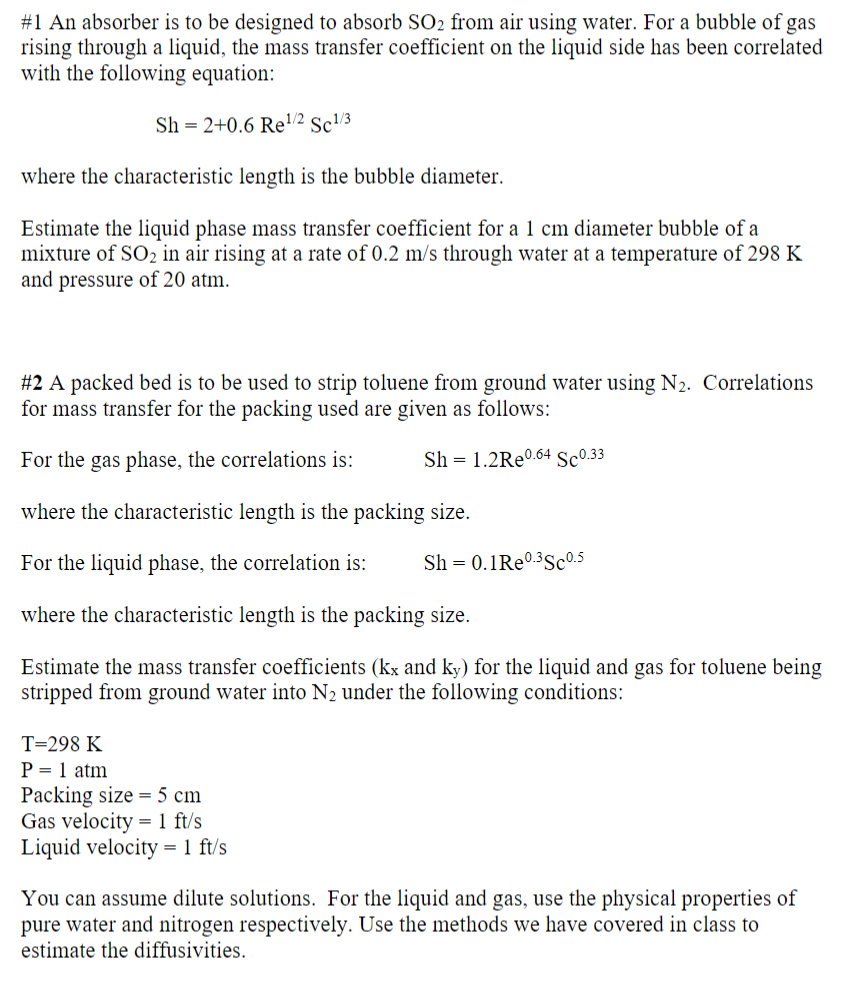

# Homeworks
# Homework 2
## [Problem Statement](https://github.com/hunterviolette/CHE362/blob/master/problem_statements/HW2.pdf)

## [Solution](https://github.com/hunterviolette/CHE362/blob/master/scripts/hw2.py)

# Homework 3
## [Problem Statement](https://github.com/hunterviolette/CHE362/blob/master/problem_statements/HW3.pdf)

## [Solution](https://github.com/hunterviolette/CHE362/blob/master/scripts/hw3.py)

# Homework 4
## [Problem Statement](https://github.com/hunterviolette/CHE362/blob/master/problem_statements/HW4.pdf)

## [Solution](https://github.com/hunterviolette/CHE362/blob/master/scripts/hw4.py)

# Exams
# Practice Exam 1
## [Problem Statement](https://github.com/hunterviolette/CHE362/blob/master/problem_statements/PE1.pdf)

## [Solution](https://github.com/hunterviolette/CHE362/blob/master/scripts/pE1.py)

# Practice Exam 3
## [Problem Statement](https://github.com/hunterviolette/CHE362/blob/master/problem_statements/PE3.pdf)

## [Solution](https://github.com/hunterviolette/CHE362/blob/master/scripts/pE3.py)

